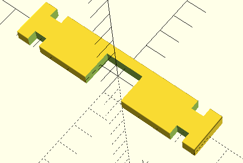

= Toy House

Simple shapes that a child can attach to each other and that way build a house.
I created the first version from birch, but I could not make it precise enough.
The 3D printed version is precise and my granddaughter loves to play with it.

The files:

* link:block.scad[`block`] contains the different blocks each as a module.
In addition to that there is a module `lay` that will arrange the children objects on the plane.
Eventually you want to print multiple from the different building blocks.
The other files simply include this file and use one module to print.

* link:basic_block.scad[`basic_block`] is the basic building block.
The other blocks are based on this block and are variant.

* link:air_vented_block.scad[`air_vented_block`] is a block with small air vents on one side.
This is a decorative variation of the basic block.

*link:half_block.scad[`half_block`] is a half block.
It can be used on parallel sides at the bottom to cover the gap that would otherwise be on the bottom.

* link:window_block.scad[`window_block`] is a block that has a window opening.
The opening reaches the edge of the block at one side.
Also, the window is in the middle.
This structure can be used printing two window blocks and putting one upside down resulting in a larger window.

* link:door_top_block.scad[`door_top_block`] is the top of a door.
The door is similar to the window, but it is to the side a bit.
To have a proportional sized door you also need the next blocks.

* link:door_side_block.scad[`door_side_block`] contains the two sides of the door.
You may need one or two each of these to have a proportional door.

* link:ceiling.scad[`ceiling`] is the roof for the house.
This is a new element and not simply a modification of the basic block.

And here is a photo of the house put together:

